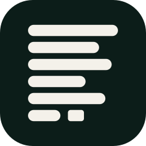
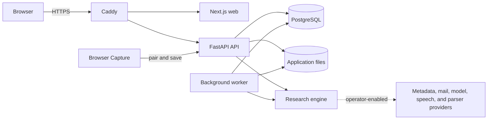

<p align="center">
  
</p>

<h1 align="center">SixSentences</h1>

<p align="center">
  <strong>An open research workspace for evidence, data, interviews, and writing.</strong>
</p>

<p align="center">
  Keep sources, transformations, decisions, and generated work inspectable—from
  the first search to the final manuscript.
</p>

<p align="center">
  <a href="https://sixsentences.com">Website</a>
  &nbsp;·&nbsp;
  <a href="https://app.sixsentences.com">Hosted workspace</a>
  &nbsp;·&nbsp;
  <a href="#quick-start">Self-host</a>
  &nbsp;·&nbsp;
  <a href="CONTRIBUTING.md">Contribute</a>
  &nbsp;·&nbsp;
  <a href="https://github.com/SixSentences/sixsentences/discussions">Discuss</a>
</p>

<p align="center">
  <a href="https://github.com/SixSentences/sixsentences/releases"></a>
  <a href="https://github.com/SixSentences/sixsentences/actions/workflows/ci.yml"></a>
  <a href="https://github.com/SixSentences/sixsentences/actions/workflows/codeql.yml"></a>
  <a href="https://github.com/SixSentences/sixsentences/actions/workflows/security.yml"></a>
  <a href="LICENSE"></a>
</p>

<p align="center">
  
</p>

> [!WARNING]
> `v0.2.0-alpha.1` is an early self-hosting release. APIs, migrations, and UI
> contracts can change before `1.0`. Inspect outputs and validate methods;
> software cannot guarantee an exhaustive search or a scientifically valid
> conclusion.

## Research, end to end

SixSentences brings the working parts of a research project into one traceable
workspace:

| | |
| --- | --- |
| **Discover and review** | Search scholarly metadata, organize a library, deduplicate records, screen evidence, and preserve source context. |
| **Work with research data** | Import bounded tables, create deterministic profiles and analyses, and build figures with visible assumptions. |
| **Run studies** | Design surveys and text or spoken interviews with explicit participant information, consent, retention, and processing gates. |
| **Develop ideas** | Connect project knowledge, brainstorming, evidence, and decisions without hiding where content came from. |
| **Write with provenance** | Draft manuscripts and LaTeX documents while keeping citations, source anchors, and revisions inspectable. |
| **Automate deliberately** | Run background jobs and optional AI-assisted workflows against operator-selected providers, budgets, and data-processing controls. |

The community edition is a complete application stack: a Next.js workspace,
FastAPI service, PostgreSQL database, background worker, Caddy edge proxy,
Manifest V3 browser-capture client, and the typed Python research engine. No
customer data, production configuration, or provider credential is bundled.

## Quick start

Requirements: Docker Engine and Docker Compose 2.33.1 or newer. Local mode uses
loopback-only public origins; use the documented TLS mode and host firewalling
before accepting real users or research data.

```console
git clone https://github.com/SixSentences/sixsentences.git
cd sixsentences
bash deploy/community/init-env.sh --local
docker compose --env-file .env.selfhost up --build --detach --wait
```

Open <http://localhost>. Read the
[self-hosting guide](deploy/community/README.md) before enabling registration,
mail, external models, web search, or spoken interviews, and read the
[backup and restore runbook](deploy/community/BACKUP-RESTORE.md) before storing
user data.

## Architecture



```text
src/sixsentences/       Python research engine and CLI
services/api/           Application API, migrations, worker, and tests
apps/web/               Next.js research workspace
apps/browser-extension/ Self-hostable Chromium capture client
deploy/community/       Self-hosting, preflight, backup, and restore tooling
compose.yaml            PostgreSQL + API + worker + web + Caddy
```

Outbound services are optional and use only credentials supplied by the
operator. Billing, checkout, subscriptions, hosted-service administration, the
production deployment, and the marketing website are intentionally not part of
this repository.

| Community source | Hosted SixSentences |
| --- | --- |
| Run and modify the research workspace on infrastructure you control | Managed at [app.sixsentences.com](https://app.sixsentences.com) |
| Bring your own mail, metadata, model, speech, and parser providers | Integrated provider and operational setup |
| No payment or subscription code | Commercial plans and billing are operated separately |
| Marketing site is not included | [sixsentences.com](https://sixsentences.com) is deployed separately |

## Development

Use the committed lockfiles and the exact component checks:

```console
# Python engine
uv sync --frozen --group dev
uv run ruff check . && uv run mypy src/sixsentences && uv run pytest -q

# API
uv sync --project services/api --frozen --all-groups
uv run --project services/api pytest services/api/tests

# Web
cd apps/web && npm ci && npm run typecheck && npm test && npm run build

# Browser extension
cd apps/browser-extension && npm ci && npm test
APP_ORIGIN=https://research.example.org \
API_ORIGIN=https://research.example.org/api \
node scripts/build.mjs --out /tmp/sixsentences-extension
```

The CI workflow also validates the application contract, self-hosting boundary,
container builds, DCO sign-offs, dependency changes, CodeQL results, and secret
and configuration scans. See [CONTRIBUTING.md](CONTRIBUTING.md) for the full
local gate and pull-request expectations.

## Contributing and security

Focused issues and pull requests are welcome. Contributions require per-commit
[Developer Certificate of Origin 1.1](DCO) sign-off and one public acceptance
of the repository [CLA](CLA.md). The local workflow uses no external CLA service
or separately stored secret. Decisions and maintainer responsibilities are
described in [GOVERNANCE.md](GOVERNANCE.md).

Report vulnerabilities through the repository's
[private advisory form](https://github.com/SixSentences/sixsentences/security/advisories/new),
never through a public issue. See [SECURITY.md](SECURITY.md).

## License

Code and documentation are available under the [Apache License 2.0](LICENSE),
except where a file says otherwise. Dependencies and adapted components retain
their own terms; see [THIRD_PARTY_NOTICES.md](THIRD_PARTY_NOTICES.md). The
SixSentences name and visual identity are protected marks; see
[TRADEMARKS.md](TRADEMARKS.md).
