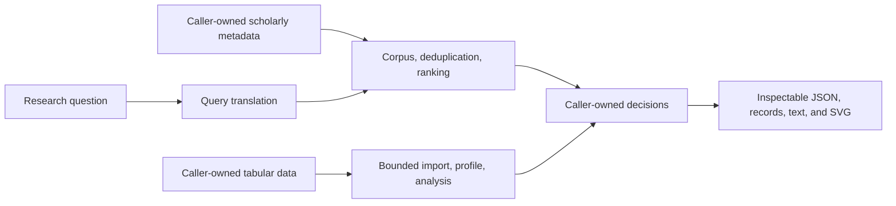

<p align="center">
  
</p>

<h1 align="center">SixSentences</h1>

<p align="center"><strong>Open building blocks for auditable research workflows.</strong></p>

<p align="center">
  Literature discovery&nbsp;&nbsp;·&nbsp;&nbsp;Research data&nbsp;&nbsp;·&nbsp;&nbsp;Evidence synthesis&nbsp;&nbsp;·&nbsp;&nbsp;Reproducible reporting
</p>

<p align="center">
  <a href="https://sixsentences.com">Website</a>
  &nbsp;·&nbsp;
  <a href="#quick-start">Quick start</a>
  &nbsp;·&nbsp;
  <a href="#how-it-fits-together">Architecture</a>
  &nbsp;·&nbsp;
  <a href="ROADMAP.md">Roadmap</a>
  &nbsp;·&nbsp;
  <a href="CONTRIBUTING.md">Contributing</a>
</p>

<p align="center">
  <a href="https://github.com/SixSentences/sixsentences/releases"></a>
  <a href="https://github.com/SixSentences/sixsentences/actions/workflows/ci.yml"></a>
  <a href="https://github.com/SixSentences/sixsentences/actions/workflows/codeql.yml"></a>
  
  <a href="LICENSE"></a>
</p>

> [!IMPORTANT]
> **Early alpha (`v0.1.0-alpha.1`).** APIs and serialized outputs may change.
> These tools expose transformations and assumptions; they do not guarantee an
> exhaustive search, methodological compliance, or scientifically valid
> conclusions.

<p align="center">
  
</p>

<p align="center"><sub><strong>Hosted product preview.</strong> The interface and hosted features shown here are not included in this repository.</sub></p>

## Move faster without hiding the research trail

SixSentences is a typed Python toolkit for transparent research workflows. The
current alpha ships inspectable building blocks for literature discovery and
evidence synthesis together with bounded, deterministic research-data
profiling and analysis. Inputs, intermediate results, and decisions remain
caller-owned.

The broader [hosted SixSentences workspace](https://sixsentences.com) connects
research questions, literature, datasets, surveys, interviews, scientific
visuals, and manuscripts. It is operated separately and is not source-released
in this repository.

## What ships today

### Discover and organize evidence

- Parse one Boolean query into a typed syntax tree and compile parameterized
  DuckDB predicates.
- Execute public-metadata searches through the explicit OpenAlex connector, or
  export query syntax for PubMed, Scopus, Web of Science, and IEEE Xplore with
  translation losses surfaced to the caller.
- Build and verify a checksummed, caller-owned DuckDB/Parquet corpus from
  `WorkRecord` JSONL; no scholarly corpus or full text is bundled.
- Deduplicate on valid canonical DOIs, preserve companion-report relationships,
  follow citation links, and rank records with decomposed relevance, citation,
  recency, and retraction signals.

### Analyse caller-owned research data

- Import bounded CSV, TSV, JSON, and ordinary first-worksheet XLSX tables with
  explicit file, row, column, cell, archive, and decompression limits.
- Reject oversized or ambiguous inputs instead of silently sampling or
  truncating them.
- Profile every accepted row deterministically, including missingness, types,
  cardinality, top values, and numeric summaries.
- Run typed recipes for missingness, descriptive statistics, grouped summaries,
  complete-case Pearson correlation, and classic DerSimonian–Laird random-effects
  pooling—with method limits returned alongside each result.

### Trace and report

- Calibrate screening decisions, inspect exploratory reviewer INCLUDE-vote
  overlap, match source quotations, and record method profiles.
- Estimate capture-frequency coverage with Chao2 only after the caller makes the
  required independence assertion; an estimate is never presented as proof of
  completeness.
- Render explicit PRISMA 2020 counts as text or deterministic SVG and construct
  PRISMA-S-style search records without claiming compliance on the caller's
  behalf.
- Validate externally generated query expansions without bundling an LLM,
  provider key, or agent loop.

## Open source and hosted SixSentences

The open-source project starts with portable research primitives. It does not
pretend that every feature in the integrated product is already available as a
self-hosted application.

| Capability | Open-source alpha | Hosted workspace |
| --- | --- | --- |
| Query translation, local corpus search, ranking, and review reporting | Portable library and CLI primitives | Connected workflow and interface |
| Bounded tabular import and deterministic analysis | Portable library and CLI primitives | Integrated Data Lab |
| Projects, workspace UI, and collaboration | Not included | Included |
| Hosted AI providers and orchestration | Not included | Included |
| Manuscript/LaTeX, Visual Lab, surveys, and interviews | Portable primitives are roadmap candidates | Included |
| Accounts, billing, deployment, backups, and analytics | Intentionally out of scope | Operated service |

The website belongs with the separately operated service: putting accounts,
billing, customer data, private provider configuration, or production
infrastructure into this repository would make the portable security and
reproducibility boundary less honest—not more open.

## Quick start

SixSentences supports Python 3.12–3.14. Until a package-index release exists,
install the exact alpha wheel from GitHub Releases:

```bash
python -m venv .venv
source .venv/bin/activate
python -m pip install \
  https://github.com/SixSentences/sixsentences/releases/download/v0.1.0-alpha.1/sixsentences_engine-0.1.0a1-py3-none-any.whl
sixsentences --help
```

Parse once, then inspect what a target can and cannot preserve:

```bash
sixsentences query \
  '("active learning" OR screen*) AND review' \
  --target openalex
```

```json
{
  "dropped_fields": [],
  "dropped_wildcards": [
    "screen"
  ],
  "query": "((\"active learning\" OR screen) AND review)"
}
```

Profile and analyse a small synthetic dataset:

```bash
printf 'group,score\nA,2\nA,4\nB,8\n' > observations.csv
sixsentences data-profile observations.csv
sixsentences data-analyze observations.csv group-summary \
  --group-by group --value-column score --metric mean
```

Structured commands emit JSON or line-oriented records. Query-syntax exports
and explicitly selected document formats such as PRISMA text/SVG emit text.

## Command-line map

| Command | Purpose | Network |
| --- | --- | --- |
| `query` | Parse and compile for DuckDB, OpenAlex, PubMed, Scopus, Web of Science, or IEEE Xplore | No |
| `corpus-build` | Build a checksummed local corpus from `WorkRecord` JSONL | No |
| `corpus-search` | Verify and search a caller-owned local corpus | No |
| `rank` | Rank JSONL work records against a typed review protocol | No |
| `coverage` | Estimate capture-frequency coverage with explicit assumptions | No |
| `prisma` | Render caller-supplied PRISMA counts as text or SVG | No |
| `expansion-validate` | Validate externally generated query candidates | No |
| `data-profile` | Import and deterministically profile a bounded table | No |
| `data-analyze` | Run an explicit deterministic analysis recipe | No |
| `openalex-search` | Fetch public scholarly metadata from OpenAlex | **Yes** |

Run `sixsentences <command> --help` for the complete input contract. The
OpenAlex command reads an optional key from `OPENALEX_API_KEY`; anonymous calls
are suitable only for small demonstrations. Never commit keys or sensitive
research data.

## How it fits together



The caller owns the audit log, screening decisions, source selection, data, and
workflow state. Networked operations are named explicitly; local operations do
not hide provider calls. The package has no database service, authentication
layer, billing code, hosted model dependency, or arbitrary code-execution path.

## Reproducibility and limits

- Pin the package version and complete environment; preserve input hashes,
  query strings, recipe parameters, and the repository revision with outputs.
- Pass an explicit reference year to ranking when a stable replay matters.
- Table profiles use every accepted row. Default import limits are safety and
  scientific-integrity boundaries, not a sampling policy.
- XLSX support is deliberately conservative: the first worksheet and cached
  scalar values are read without executing formulas, macros, scripts, external
  relationships, or embedded objects.
- Ranking scores prioritize inspection; correlations do not establish
  causation; pooled effects do not validate study comparability, bias, or a
  statistical-analysis plan.
- PRISMA rendering consumes explicit counters. It cannot infer that a review or
  search method was compliant.

## Development and review

```bash
git clone https://github.com/SixSentences/sixsentences.git
cd sixsentences
uv sync --frozen --group dev
uv run ruff check .
uv run ruff format --check .
uv run mypy src/sixsentences
uv run pytest -q
uv build
```

Direct dependencies are exactly pinned and the full environment is hash-locked
in `uv.lock`. CI tests Python 3.12, 3.13, and 3.14; CodeQL, dependency review,
release smoke tests, checksums, an SBOM, and artifact attestations protect the
public release path.

Start with [CONTRIBUTING.md](CONTRIBUTING.md), then read
[GOVERNANCE.md](GOVERNANCE.md) and [ROADMAP.md](ROADMAP.md). Contributions use
the [Developer Certificate of Origin 1.1](DCO) instead of a separate CLA. Every
contributor signs off only their own commits. Security reports belong in
GitHub's private flow described in [SECURITY.md](SECURITY.md), never in a public
issue.

## Citation

If this toolkit contributes to research, cite the exact release or commit and
describe the surrounding search, screening, and analysis method. Machine-readable
metadata is available in [CITATION.cff](CITATION.cff).

## License and marks

Source code and written documentation are licensed under the
[Apache License 2.0](LICENSE). Dependencies and external data sources retain
their own terms; see [THIRD_PARTY_NOTICES.md](THIRD_PARTY_NOTICES.md).

The SixSentences name, logo, and visual identity are project marks and are not
licensed for reuse under Apache-2.0. Customary attribution and nominative use
remain permitted; see [TRADEMARKS.md](TRADEMARKS.md).

<details>
<summary>Accessible transcript for the hosted-product preview</summary>

Research moves fast. Your tools should, too. Meet SixSentences, the AI-powered
workspace built for scientific research. Run systematic literature reviews,
discover relevant papers automatically, and jump straight to the passages that
matter. Every source stays organized, with metadata extracted automatically
into your library. Create scientific graphics directly in Visual Lab. Analyze
surveys, interviews, and research data with AI. Then bring your sources,
analyses, and visuals together in Manuscript, and write with AI and LaTeX. With
the PC companion and browser extension, SixSentences stays wherever you
research.

</details>
