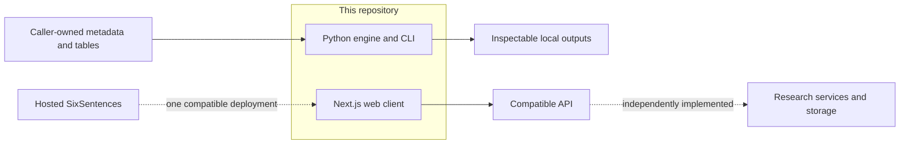

<p align="center">
  
</p>

<h1 align="center">SixSentences</h1>

<p align="center"><strong>An inspectable research workspace—from literature discovery to evidence, data, figures, and writing.</strong></p>

<p align="center">
  Discover evidence&nbsp;&nbsp;·&nbsp;&nbsp;Analyse research data&nbsp;&nbsp;·&nbsp;&nbsp;Trace decisions&nbsp;&nbsp;·&nbsp;&nbsp;Build research workflows
</p>

<p align="center">
  <a href="https://sixsentences.com">Website</a>
  &nbsp;·&nbsp;
  <a href="https://app.sixsentences.com">Hosted app</a>
  &nbsp;·&nbsp;
  <a href="#quick-start">Get started</a>
  &nbsp;·&nbsp;
  <a href="apps/web/README.md">Web client</a>
  &nbsp;·&nbsp;
  <a href="ROADMAP.md">Roadmap</a>
  &nbsp;·&nbsp;
  <a href="CONTRIBUTING.md">Contributing</a>
</p>

<p align="center">
  <a href="https://github.com/SixSentences/sixsentences/releases"></a>
  <a href="https://github.com/SixSentences/sixsentences/actions/workflows/ci.yml"></a>
  <a href="https://github.com/SixSentences/sixsentences/actions/workflows/codeql.yml"></a>
  
  
  <a href="LICENSE"></a>
</p>

<p align="center">
  
</p>

<p align="center"><sub>The repository includes the sanitized workspace client in <code>apps/web</code>; hosted infrastructure and commercial services remain separate.</sub></p>

> [!IMPORTANT]
> **Early alpha (`v0.1.0-alpha.1`).** Public APIs, UI contracts, and serialized
> outputs may change. SixSentences makes transformations and assumptions easier
> to inspect; it does not guarantee an exhaustive search, methodological
> compliance, or scientifically valid conclusions.

## What is open

SixSentences is broader than a systematic-review library. This repository opens
two complementary parts of the research workspace while keeping their runtime
boundary explicit:

| Surface | What is included | Runtime boundary |
| --- | --- | --- |
| **Research engine** | A typed Python library and CLI for literature discovery, local corpora, evidence synthesis, reporting, and bounded research-data analysis | Runs locally; only explicitly named connectors use the network |
| **Web client** | A sanitized Next.js interface spanning search, library, projects, data, figures, surveys, interviews, knowledge, brainstorming, and manuscript workflows | Requires a separately supplied compatible API; it is not a standalone backend |

The Python package is not the server for the web client. Opening both surfaces
lets contributors inspect and extend the research logic and the workspace
interface without pretending that the complete hosted SaaS stack is present.

## What ships today

### Discover and organize evidence

- Parse Boolean queries into a typed syntax tree and compile parameterized
  DuckDB predicates.
- Search public scholarly metadata through the explicit OpenAlex connector, or
  export query syntax for PubMed, Scopus, Web of Science, and IEEE Xplore with
  translation losses surfaced to the caller.
- Build and verify a checksummed, caller-owned DuckDB/Parquet corpus from
  `WorkRecord` JSONL; no scholarly corpus or full text is bundled.
- Deduplicate valid canonical DOIs, preserve companion-report relationships,
  follow citation links, and rank records with decomposed signals.

### Analyse caller-owned research data

- Import bounded CSV, TSV, JSON, and ordinary first-worksheet XLSX tables with
  explicit file, row, column, cell, archive, and decompression limits.
- Reject oversized or ambiguous inputs instead of silently sampling or
  truncating them.
- Profile every accepted row deterministically, including missingness, types,
  cardinality, top values, and numeric summaries.
- Run typed recipes for missingness, descriptive statistics, grouped summaries,
  complete-case Pearson correlation, and classic DerSimonian–Laird
  random-effects pooling, with method limits returned beside each result.

### Trace methods and outputs

- Calibrate screening decisions, inspect exploratory reviewer INCLUDE-vote
  overlap, match source quotations, and record method profiles.
- Estimate capture-frequency coverage with Chao2 only after the caller makes the
  required independence assertion; an estimate is never presented as proof of
  completeness.
- Render caller-supplied PRISMA 2020 counts as text or deterministic SVG and
  construct PRISMA-S-style search records without claiming compliance.
- Validate externally generated query expansions without bundling an LLM,
  provider key, or agent loop.

### Inspect and extend the workspace interface

The web client exposes the broader product vocabulary in source: literature
runs and review, a research library, project context, Data Lab, Visual Lab,
surveys, interviews, knowledge, brainstorming, and manuscript/LaTeX workspaces.
It includes browser-side state, typed API calls, streaming progress, source and
provenance displays, accessibility behavior, and focused UI tests.

These interfaces only become functional when connected to an API implementing
their contracts. Hosted AI execution, persistence, authentication services,
email delivery, and collaboration services are not supplied by this repository.

## Repository map

```text
.
├── src/sixsentences/   # Python research engine
├── tests/              # Python unit, contract, and adversarial tests
├── apps/web/           # Sanitized Next.js research-workspace client
├── docs/               # Project and release documentation
└── .github/            # Contribution, security, and release automation
```

The GitHub source tree contains both open surfaces. The Python wheel and source
distribution published with a release contain the `sixsentences-engine`
package, not a bundled web deployment.

## Open-source and hosted boundary

| Capability | This repository | Separately operated |
| --- | --- | --- |
| Query translation, local corpus search, ranking, screening, and research-data primitives | Python library and CLI | Integrated hosted workflows may build on related concepts |
| Multi-workflow research workspace UI | Sanitized Next.js client source | Production deployment and compatible API |
| Accounts and authentication | Client-side flows and API contracts only | Identity, session, email, and account services |
| AI providers and orchestration | No provider keys or hosted orchestration | Model execution and provider operations |
| Billing, subscriptions, administration, and service operations | Excluded | Hosted service |
| Marketing and landing website | Excluded | [sixsentences.com](https://sixsentences.com) |
| Browser extension and macOS companion | Excluded from this release | Separately distributed products |
| Customer data, production configuration, backups, and analytics infrastructure | Excluded | Hosted service |

This is therefore an open-source engine and web client, **not yet a complete
self-hosting stack**. A compatible API can be implemented independently; the
public compatibility contract will be hardened and documented over time.

## Quick start

### Python engine

SixSentences supports Python 3.12–3.14. Until a package-index release exists,
install the exact alpha wheel from GitHub Releases:

```bash
python -m venv .venv
source .venv/bin/activate
python -m pip install \
  https://github.com/SixSentences/sixsentences/releases/download/v0.1.0-alpha.1/sixsentences_engine-0.1.0a1-py3-none-any.whl
sixsentences --help
```

Parse once, then inspect what a target can and cannot preserve:

```bash
sixsentences query \
  '("active learning" OR screen*) AND review' \
  --target openalex
```

Profile and analyse a small synthetic dataset:

```bash
printf 'group,score\nA,2\nA,4\nB,8\n' > observations.csv
sixsentences data-profile observations.csv
sixsentences data-analyze observations.csv group-summary \
  --group-by group --value-column score --metric mean
```

### Web client

The web client requires Node.js 22.9 or newer and a compatible API. Public
configuration is read at build time; do not place secrets in `NEXT_PUBLIC_*`
variables.

```bash
git clone https://github.com/SixSentences/sixsentences.git
cd sixsentences/apps/web
cp .env.example .env.local
npm ci
npm run dev
```

The development UI is then available at `http://localhost:3000`. A successful
page render does not imply that API-backed actions are available. See
[`apps/web/README.md`](apps/web/README.md) for the configuration and integration
contract.

## Command-line map

| Command | Purpose | Network |
| --- | --- | --- |
| `query` | Parse and compile for DuckDB, OpenAlex, PubMed, Scopus, Web of Science, or IEEE Xplore | No |
| `corpus-build` | Build a checksummed local corpus from `WorkRecord` JSONL | No |
| `corpus-search` | Verify and search a caller-owned local corpus | No |
| `rank` | Rank JSONL work records against a typed review protocol | No |
| `coverage` | Estimate capture-frequency coverage with explicit assumptions | No |
| `prisma` | Render caller-supplied PRISMA counts as text or SVG | No |
| `expansion-validate` | Validate externally generated query candidates | No |
| `data-profile` | Import and deterministically profile a bounded table | No |
| `data-analyze` | Run an explicit deterministic analysis recipe | No |
| `openalex-search` | Fetch public scholarly metadata from OpenAlex | **Yes** |

Run `sixsentences <command> --help` for the complete input contract. The
OpenAlex command reads an optional key from `OPENALEX_API_KEY`; never commit keys
or sensitive research data.

## Architecture



The engine keeps local transformations explicit and names networked operations.
The web client is a separate browser application: its configured API origin is
a trust boundary, and research content sent through it is governed by that
API's deployment and policies.

## Reproducibility and limits

- Pin the exact engine release or commit and complete environment; preserve
  input hashes, query strings, recipe parameters, and the repository revision.
- Pass an explicit reference year to ranking when a stable replay matters.
- Table profiles use every accepted row. Import limits are safety and
  scientific-integrity boundaries, not a sampling policy.
- XLSX support reads the first worksheet and cached scalar values without
  executing formulas, macros, scripts, external relationships, or embedded
  objects.
- Ranking scores prioritize inspection; correlations do not establish
  causation; pooled effects do not validate comparability, bias, or an analysis
  plan.
- PRISMA rendering consumes explicit counters. It cannot infer that a review or
  search method was compliant.
- The web client does not make an API reproducible by itself. Record the client
  revision, API implementation/version, model/provider configuration, and
  relevant workflow settings when reporting results.

## Development and review

Python checks:

```bash
uv sync --frozen --group dev
uv run ruff check .
uv run ruff format --check .
uv run mypy src/sixsentences
uv run pytest -q
uv build
```

Web checks:

```bash
cd apps/web
npm ci
npm run typecheck
npm run test:security
npm run test:ui
npm run build
```

Dependencies are locked in `uv.lock` and `apps/web/package-lock.json`. Review
the exact artifact you distribute: a lockfile records dependency metadata but
does not by itself establish which optional platform packages a built image
contains.

Start with [CONTRIBUTING.md](CONTRIBUTING.md), then read
[GOVERNANCE.md](GOVERNANCE.md) and [ROADMAP.md](ROADMAP.md). Contributions use
the [Developer Certificate of Origin 1.1](DCO), not a separate CLA. Every human
contributor signs off their own commits. Report vulnerabilities through the
private flow in [SECURITY.md](SECURITY.md), never in a public issue.

## Citation

If this software contributes to research, cite the exact release or commit and
describe which engine and/or web-client functions were used together with the
surrounding method. Machine-readable metadata is available in
[CITATION.cff](CITATION.cff).

## License and marks

Except for separately identified marks and third-party material, source code
and written documentation are licensed under the
[Apache License 2.0](LICENSE). Dependencies and adapted components retain their
own terms; see [THIRD_PARTY_NOTICES.md](THIRD_PARTY_NOTICES.md).

The SixSentences name, logo, icon, and visual identity are project marks and are
not licensed for reuse under Apache-2.0. Customary attribution and nominative
use remain permitted; see [TRADEMARKS.md](TRADEMARKS.md).
