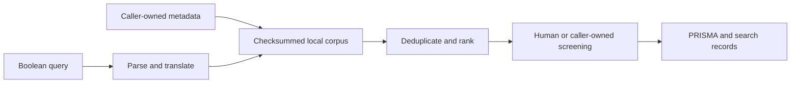

# SixSentences Engine

[](https://github.com/SixSentences/sixsentences/actions/workflows/ci.yml)
[](https://github.com/SixSentences/sixsentences/actions/workflows/codeql.yml)
[](LICENSE)

Transparent, composable building blocks for systematic literature-search
workflows.

https://github.com/user-attachments/assets/26bcfc2f-2f2d-432f-bf33-0e8e0645fa14

*45-second overview of the separately operated hosted SixSentences product.
The interface and hosted features shown above are not included in this engine
repository.*

<details>
<summary>Video transcript</summary>

Research moves fast. Your tools should, too. Meet SixSentences, the AI-powered
workspace built for scientific research. Run systematic literature reviews,
discover relevant papers automatically, and jump straight to the passages that
matter. Every source stays organized, with metadata extracted automatically
into your library. Create scientific graphics directly in Visual Lab. Analyze
surveys, interviews, and research data with AI. Then bring your sources,
analyses, and visuals together in Manuscript, and write with AI and LaTeX. With
the PC companion and browser extension, SixSentences stays wherever you
research.

</details>

SixSentences Engine parses and translates Boolean queries, searches a local
DuckDB/Parquet corpus, ranks scholarly metadata with decomposed scores, and
formats caller-supplied review counts as PRISMA outputs. It is a small Python
library and command-line tool designed to be embedded in workflows whose data,
orchestration, and final decisions remain under the caller's control.

> [!IMPORTANT]
> **This is an early alpha.** Interfaces and serialized formats may change
> before `1.0`. The engine assists literature-search workflows; it does not by
> itself produce a systematic review, guarantee search completeness, validate
> clinical or regulatory conclusions, or replace expert judgment.

## What is in this repository

- A Boolean query AST and parser with a parameterized DuckDB predicate and
  translations for OpenAlex, PubMed, Scopus, Web of Science, and IEEE Xplore.
  The OpenAlex translator explicitly reports field qualifiers and wildcards it
  cannot preserve.
- A checksummed local corpus snapshot backed by DuckDB and Parquet.
- Valid canonical DOI-only destructive deduplication and non-destructive companion-report links.
- Decomposed ranking signals for relevance, age-normalized citation impact,
  recency, and retraction penalties.
- Capture-frequency coverage estimation using Chao2, with the estimate exposed
  as an estimate rather than a completeness claim.
- Provider-neutral query-expansion validation and saturation bookkeeping.
- Citation-snowballing helpers and public-metadata connectors for OpenAlex and
  Retraction Watch.
- Screening calibration, exploratory reviewer INCLUDE-vote overlap assessment,
  source-quote matching, and method-profile utilities.
- Text and SVG PRISMA 2020 flow rendering plus PRISMA-S-style search records.

The engine favors explicit inputs and inspectable intermediate results. It does
not hide network calls behind local operations, and it does not contain an LLM
provider, agent loop, database service, or web application.

## What is intentionally not included

This is the **community engine**, not a source release of the hosted
SixSentences product. The repository does not contain:

- the SixSentences website or hosted application UI;
- accounts, authentication, tenancy, subscriptions, billing, or payments;
- hosted LLM workflows or private provider configuration;
- production deployment, backup, observability, or operator tooling;
- production data, credentials, private legal records, or proprietary datasets.

The hosted service at [sixsentences.com](https://sixsentences.com) is operated
separately and may contain features that are not part of this repository.

## Quick start

Python 3.12 or newer and [uv](https://docs.astral.sh/uv/) are recommended.

```bash
git clone https://github.com/SixSentences/sixsentences.git
cd sixsentences
uv sync --frozen --group dev
uv run sixsentences --help
```

Parse a query and inspect its OpenAlex translation:

```bash
uv run sixsentences query \
  '("large language model" OR llm) AND screening' \
  --target openalex
```

The same parser can produce a parameterized DuckDB predicate:

```bash
uv run sixsentences query 'title:transformer AND NOT survey' --target duckdb
```

Library use is equally direct:

```python
from sixsentences.querylang.compile_openalex import compile_openalex
from sixsentences.querylang.parser import parse_query

query = parse_query('("active learning" OR screen*) AND review')
openalex_query, translation_notes = compile_openalex(query)

print(openalex_query)
print(translation_notes.dropped_fields)
print(translation_notes.dropped_wildcards)
```

## Command-line surface

| Command | Purpose |
| --- | --- |
| `query` | Parse and compile a Boolean query for DuckDB, OpenAlex, PubMed, Scopus, Web of Science, or IEEE Xplore |
| `corpus-build` | Build a local checksummed corpus from `WorkRecord` JSONL |
| `corpus-search` | Search a verified local corpus |
| `openalex-search` | Fetch public scholarly metadata from OpenAlex |
| `rank` | Rank JSONL work records against a review protocol |
| `coverage` | Estimate coverage from capture frequencies |
| `prisma` | Render explicit PRISMA counters as text or SVG |
| `expansion-validate` | Validate externally generated query candidates |

Run `uv run sixsentences <command> --help` for inputs and options. Networked
commands are explicit. OpenAlex permits a few anonymous demo calls, but a free
API key is strongly recommended and is required for sustained or production
use; `openalex-search` reads it from `OPENALEX_API_KEY`. Never commit keys or
downloaded sensitive data.

## Design boundaries



The caller owns the audit log, screening decisions, source selection, and
workflow state. PRISMA rendering consumes explicit counters; it does not infer
that a search was compliant. Coverage estimates require an external basis for
treating capture occasions as independent and at least two singleton captures.
The CLI requires the explicit `--occasion-independence-verified` opt-in;
otherwise it returns an undetermined result. Ranking signals are prioritization
aids, not relevance judgments.

For reproducible runs, pin the package and lockfile, preserve the input-data
version and query string, pass an explicit reference year to ranking, and
record the repository revision alongside outputs.

## Development

```bash
uv sync --frozen --group dev
uv run ruff check .
uv run ruff format --check .
uv run mypy src/sixsentences
uv run pytest -q
uv build
```

Tests use deterministic fixtures and `PYTHONHASHSEED=42` in CI. Contributions
should not add secrets, production artifacts, copyrighted full text, or
personally identifying research data.

Direct dependencies are exactly pinned in `pyproject.toml`, and the complete
development and runtime dependency graph is hash-locked in `uv.lock`. Use
`--frozen` for reproducible installs; review and commit an intentional lockfile
update whenever dependencies change.

Start with [CONTRIBUTING.md](CONTRIBUTING.md), then see
[GOVERNANCE.md](GOVERNANCE.md) and [ROADMAP.md](ROADMAP.md). Please use GitHub
Issues for reproducible bugs and bounded proposals. Security reports belong in
GitHub's private vulnerability-reporting flow described in
[SECURITY.md](SECURITY.md), never in a public issue.

## Citation

If this engine contributes to research, cite the exact version or commit you
used and describe the surrounding search and screening method. Machine-readable
metadata is available in [CITATION.cff](CITATION.cff).

## License and marks

Code and documentation in this repository are licensed under the
[Apache License 2.0](LICENSE). Dependencies and external data sources retain
their own terms; see [THIRD_PARTY_NOTICES.md](THIRD_PARTY_NOTICES.md).

The license does not grant rights to the SixSentences name, logo, or visual
identity beyond customary attribution. See [TRADEMARKS.md](TRADEMARKS.md).
